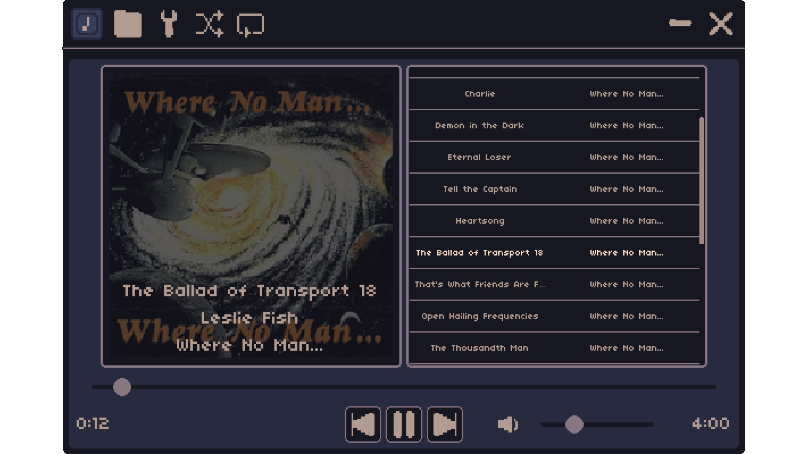

# About
- Mini-Music-Player is a small music player desktop application I developed for my personal use and as a means of learning the UI system of the [Godot](https://godotengine.org/) game engine. Scripted with C#.

# Features
- 📻Supports mp3, wav, and ogg files
- 📂Directory based playlists
- 🎨Minimal UI with scaling options to fit different displays
# Hotkeys
- Play/Pause: Spacebar
- Volume Up/Down: Up/Down Arrows
- Scrub Back/Forwards: Left/Right Arrows
- RMB (HOLD): Move Window
# Credits
- Font: [04b03](https://www.dafont.com/04b-03.font)
- Palette: [Bastille-8](https://lospec.com/palette-list/bastille-8) by Antho24
- Metadata Handling: [taglib-sharp](https://github.com/mono/taglib-sharp)